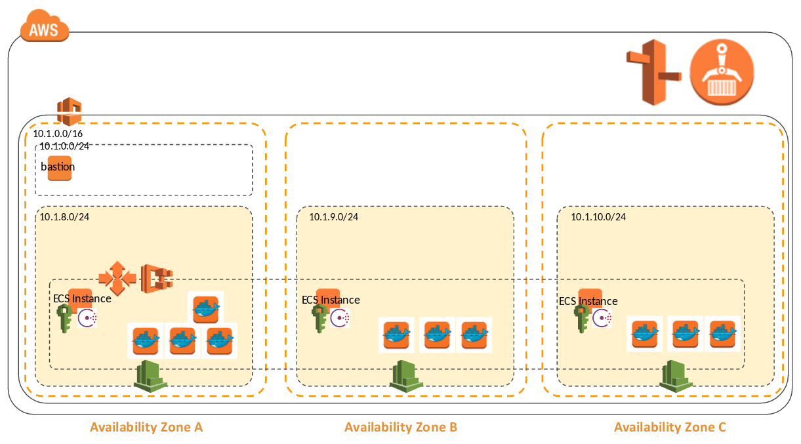
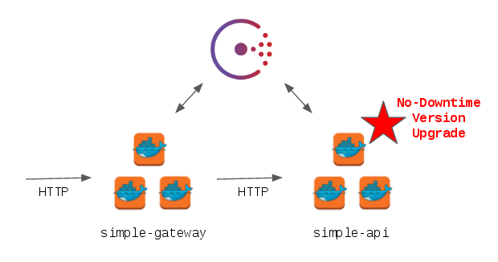

# A simple Blue/Green Container Update with AWS ECS and Consul 

This project demonstrates the deployment of Consul with AWS EC2 Container Services (ECS). It heavily relies on Terraform and, obviously, Docker. It is intended to demonstrate some of the benefits of Consul withby using ECS. It is also a "simple but yet complete/scalable stack" for testing and learning. It should be easy enough to setup so that people can fork it and do some interesting stuff. Whether it may or may not be used to bootstrap a production configuration is actually a good question. 

## Overview

The overall architecture the project generates is shown below: 

->  <-

It includes:

- A VPC spread across 3 Availability Zones (AZ) with 3 private subnets and a subnet that can access the Internet. The underlying infrastructure, includes a Private Hosted Zone (Route53), a NAT and an Internet Gateway as well as a bastion server to access private subnets
- An ECS cluster relying on an EC2 Launch Configuration/Autoscaling Group. It is and should remain a 3-instance cluster or, with a change to the ```bootstrap_expect``` parameter, it could be a 5-instance cluster 
- Consul and Gliderlabs/Registrator are deployed as Containers. They come from the Docker Hub
- 2 Docker projects are included and stored in the account docker registry (ECR). They are 2 very simple Python Flask projects and can be used to demonstrate the blue/green update

## Deployment and Removal

### Configuring your environment

- This project requires Docker for Linux; If you run on Windows/MAC, get a Linux VM/Instance to begin
- Required components include AWS CLI, Terraform, Git, Make and OpenSSL.
- If not already done, create an AWS account and a user in IAM that will be able to create and access the resources you plan to build. Get an Access/Secret Key for that user/account
- Fork this repository in your GitHub account by clicking the "Fork" button. Once done, clone it from a Linux/Mac machine with ```git clone https://github.com/[your account]/ecs-unleashed.git```
- Choose and set the following environment variables:
  * ```ACCOUNT``` can be any name used to define your AWS account. You can use the name you've choosen to access your account or the account ID for instance
  * ```REGION``` is the AWS region you want to use. Note that the model relies on 3 AZ and you must use a region with 3 AZ or more
  * ```ENV``` is a name from the environment you want to build and is used to differentiate several concurrent environments. Due to some AWS naming limits, ENV is limited to 6 characters in length even if it is not enforced.
- Register the Access/Secret Key with your AWS CLI; We rely on a convention that the profile is named \[ACCOUNT\]-\[ENV\] in the project

```
aws configure --profile=[youraccount]-[yourenv]
```

   Note:
   It is very important to set the environment variables as expected ; if you don't you might end up destroying some resources. In order to avoid that, don't hesitate to set the variable as part of the command line and disabling the AWS CLI profile you don't want to use, including the default profile vy editing the ```~/.aws/credentials``` file.

### Configuring the project

The project assumes:
- Some variables are store in ```terraform/configurations/[ACCOUNT]/[SHORTNAME]```
- State files are stored in a S3 bucket. 

Firt thing first, you must initialize the project. The command below creates a ```env.tfvars``` file with a ```uniquekey``` property in ```terraform/configurations/[ACCOUNT]/[SHORTNAME]```. It also creates a S3 bucket named terraform-[SHORTNAME]-[UNIQUEKEY] to store the different state files:

```
ACCOUNT=[youraccount] ENV=[yourenv] REGION=eu-west-1 make init
```

You must adapt the configuration to your needs. Once the project initiated, change values in ```env.tfvars```:

- ```uniquekey``` do not change that value once initialize. It helps to link the project with its state.
- ```region``` (default "eu-west-1") is the AWS region you plan to use
- ```netprefix``` (default "10.1") is the /16 network prefix you plan to use with your VPC
- ```keypair``` (no default) is a SSH key you hace created and stored on EC2 and can use to access instances
- ```ami-ec2``` (default "ami-9398d3e0") is the AMI of the Bastion instance. Update it with the latest AMI of your region
- ```ami-ecs``` (default "ami-e988c39a") is the AMI of the ECS Cluster instance. Update it with the latest AMI of your region

### Deploying the project

Assuming you've done everything as expected and don't break some secret rules, deploying the infrastructure should be as simple as:

```
ACCOUNT=[youraccount] ENV=[yourenv] make infrastructure
```

Once you've deployed the infrastructure, you should be able to build and push the docker applications:

```
cd docker/simple-api
ACCOUNT=[youraccount] ENV=[yourenv] make build
ACCOUNT=[youraccount] ENV=[yourenv] make install
cd ../simple-gateway
ACCOUNT=[youraccount] ENV=[yourenv] make build
ACCOUNT=[youraccount] ENV=[yourenv] make install

```

To deploy the docker container, run the command below:

```
ACCOUNT=[youraccount] ENV=[yourenv] make services
```

### Destroying the configuration

Removing containers just require you run the command below:

```
ACCOUNT=[youraccount] ENV=[yourenv] make destroy_services
```


To destroy the infrastructure, run the command below:

```
ACCOUNT=[youraccount] ENV=[yourenv] make destroy
```

   Note:
   When destroying the stack, you might get an error saying it cannot destroy Route53 PHZ because some records remain inside. It's seems due to a limit of Terraform that does not respect the ```force_destroy = true``` directive in ```aws_route53_zone```. Remove the ```consulN.[yourenv].local``` records and run the destruction command again.
  
## Blue/Green quick Demonstration

You are ready to demonstrate some of the benefits of Consul with ECS. Instead of relying on Loadbalancers to connect services one-another, you can now rely on the registry consul provide. The goal of the ```simple-gateway``` and ```simple-api``` containers is to demonstrate that ability the way they work is summarized below:

->  <-

To perform that demonstration, query the ```simple-api``` application through ```simple-gateway```:
- Connect with SSH to the bastion with the address displayed as an output of the ```make infrastructure``` command 
- Query consul to figure-out the IpAddress/Port of one instance of the ```simple-gateway``` container. Pick-up any 
```
curl consul1.[yourenv].local:8500/v1/catalog/service/simple-gateway \
   | python -m json.tool
```
- Query ```simple-api``` through that ```simple-gateway``` every second. We assume below you've choosen ```10.1.10.103:32770``` to access the gateway:
```
while true; do
   echo -en $(curl 10.1.10.103:32770/simple-api 2>/dev/null)
   sleep 1
done
```

   Note:
   The reason we run ```echo -e``` is to leverage the color codes that are returned by the ```simple-api``` version
   
You can now modify the container. In order to proceed:

- Change the code of the ```appversion()``` function of ```docker/simple-api/app/webserver.py``` to return another output
- Change the version number in ```docker/simple-api/app/version.txt```
- Rebuild/Redeploy the container to its repository with the new version

```
cd docker/simple-api
ACCOUNT=[youraccount] ENV=[yourenv] make build
ACCOUNT=[youraccount] ENV=[yourenv] make install
```

- Change the version in the Terraform project to match the one you've just redeployed for the ```simple-api```. That parameter is part of the ```terraform/deployments/services/components.tf``` file.
- Upgrade Terraform Service deployment with the command below:

```
cd ../.. 
ACCOUNT=[youraccount] ENV=[yourenv] make services
```

   Note:
   The container upgrade can take quite some time. Be patient and review the "ECS service Events" to troubleshoot the upgrade if needed.

## To continue

Fork the project, build demonstration/tests of your own. Raise issues, provide feedback. Have fun with Consul and AWS!
